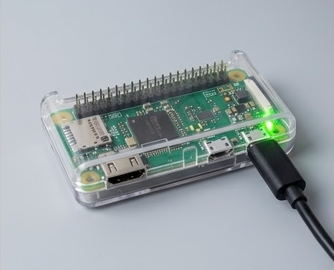
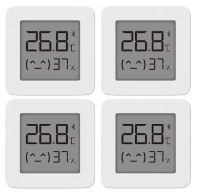
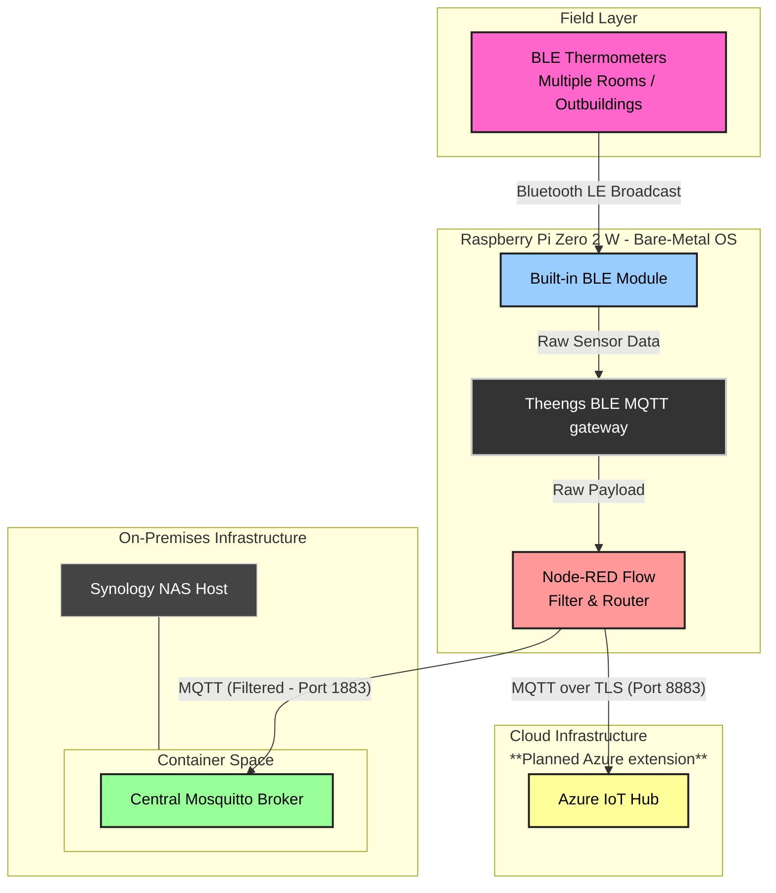
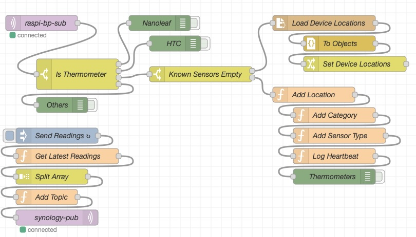

BTGateway
=========

**BTGateway** is an edge data collector running on a headless Raspberry Pi Zero 2 W (figure 1). It collects and decodes Bluetooth thermometer telemetry data, enriches it with metadata, and publishes MQTT messages to the central broker. The thermometers are very affordable Xiaomi Mijia devices (figure 2) running custom firmware loaded following instructions in [ATC_MiThermometer](https://github.com/pvvx/ATC_MiThermometer) GitHub repository. The data collection is done by [Theengs Gateway](https://gateway.theengs.io), which runs on the Raspberry Pi devices. The logic of filtering out other bluetooth devices, formatting and enriching data is done in a Node-RED workflow (figure 3).

   
  <em>Figure 1: Raspberry Pi Zero 2 W setup running headless.</em>

   
  <em>Figure 2: Bluetooth thermometers.</em>

## System Architecture

<em>Figure 3: System Architecture.</em>

### Data Pipeline & Architecture Layers

1. **Physical / Wireless Layer:** Battery-powered BLE thermometers distributed across rooms and outbuildings continuously broadcast advertising packets containing temperature data.
2. **Hardware Ingestion:** The built-in Bluetooth Low Energy module on the Raspberry Pi Zero 2 W scans the airwaves and intercepts these BLE broadcasts.
3. **Data Collection Layer:** Theengs Gateway installed on the Raspberry Pi collects readings broadcasted by any bluetooth devices within range and transforms them into MQTT messages sent to a local Mosquitto broker.
4. **Edge Orchestration & Filtering:** A local bare-metal Node-RED flow subscribes to the local broker. It acts as a filter, filtering out MAC addresses from foreign, ambient Bluetooth devices to keep data clean. It also reformats the messages and adds location and category information.
5. **Dual Route Data Transmission:** Currently only the local storage route has been implemented but the filtered, verified thermometer data will be split into two pathways by Node-RED:
   * **Local Storage Route:** Transmitted across the local network over TCP (Port 1883) to the primary, containerised Eclipse Mosquitto broker running on the Synology NAS.
   * **Cloud Ingestion Route:** Encrypted and transmitted over WAN using MQTT over TLS (Port 8883) directly into **Azure IoT Hub** for off-site monitoring and retention.

### Node-RED Flow

   
  <em>Figure 4: The Node-RED flow.</em>

Example MQTT message sent to the central broker: 
Topic: .../greenhouse/environment/LYWSD03MMC_MJWSD05MMC_ATC/ATC_... 
Message payload: {"id":"...","name":"ATC_...","brand":"Xiaomi","model":"LYWSD03MMC_MJWSD05MMC_ATC","last_logged":"2026-09-01T10:20:37.270Z","tempc":26.8,"tempf":80.24,"hum":46,"batt":100,"category":"environment","house":"...","room":"greenhouse","type":"thermometer"} 
The timestamp, location, category, and sensor type data are added by the flow.

### Prerequisites / Deploy

1. **Hardware:** Raspberry Pi Zero 2 W quite comfortable runs Theengs Gateway and Node-RED.
2. **Software:** [Theengs Gateway](https://gateway.theengs.io/install/install.html) with its prerequisites and [Node-RED](https://nodered.org/docs/getting-started/raspberrypi) following their official getting started guide. No extra nodes had to be installed.

### Reliability & Security

Theengs Gateway sends messages with QoS of 0 (fire and forget). This is sufficient for thermometer readings as they are being broadcasted several times per minute. Missing single reading doesn't matter. Node-RED flow processes the messages and sends them to the central broker with QoS of 1 making sure it gets each message at least once. Each message is timestamped which helps dealing with potential duplicates. 
 
There is a template file called sensors.example.json. It is a template for providing a list of known sensors and their locations. It should be renamed to sensors.json and contain data relevant for each deployment. Local settings and credential files like flows_cred.json have been included in .gitignore so they are not accidentally committed.
