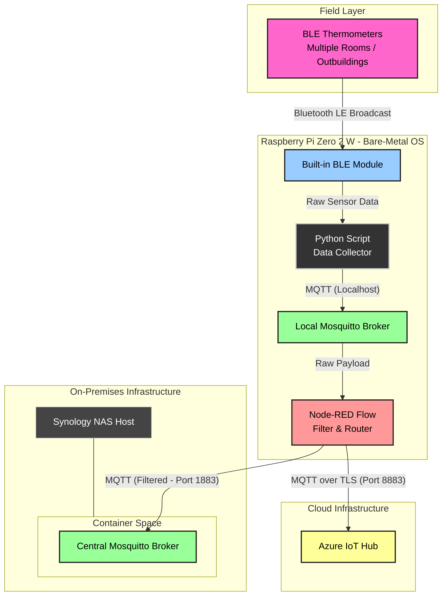

BTGateway
=========

Bluetooth Gateway

## System Architecture

### Data Pipeline & Architecture Layers

1. **Physical / Wireless Layer:** Battery-powered BLE thermometers distributed across rooms and outbuildings continuously broadcast advertising packets containing temperature data.
2. **Hardware Ingestion:** The built-in Bluetooth Low Energy module on the Raspberry Pi Zero 2 W scans the airwaves and intercepts these BLE broadcasts.
3. **Data Collection Layer:** A background Python script parses the raw BLE payloads, extracts the thermometer readings, and immediately publishes them to a localized, bare-metal instance of Eclipse Mosquitto running on the Pi.
4. **Edge Orchestration & Filtering:** A local bare-metal Node-RED flow subscribes to the local broker. It acts as an intelligent firewall, filtering out MAC addresses from foreign, ambient Bluetooth devices to keep data clean.
5. **Dual Route Data Transmission:** The filtered, verified thermometer data is split into two pathways by Node-RED:
   * **Local Storage Route:** Transmitted across the local network over TCP (Port 1883) to the primary, containerised Eclipse Mosquitto broker running on the Synology NAS.
   * **Cloud Ingestion Route:** Encrypted and transmitted over WAN using MQTT over TLS (Port 8883) directly into **Azure IoT Hub** for off-site monitoring and retention.
